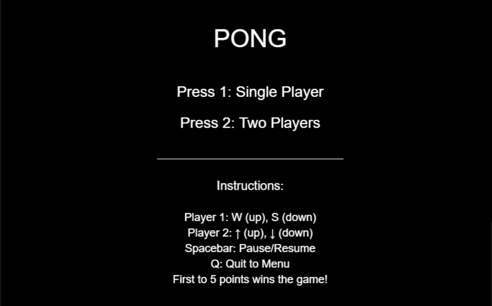
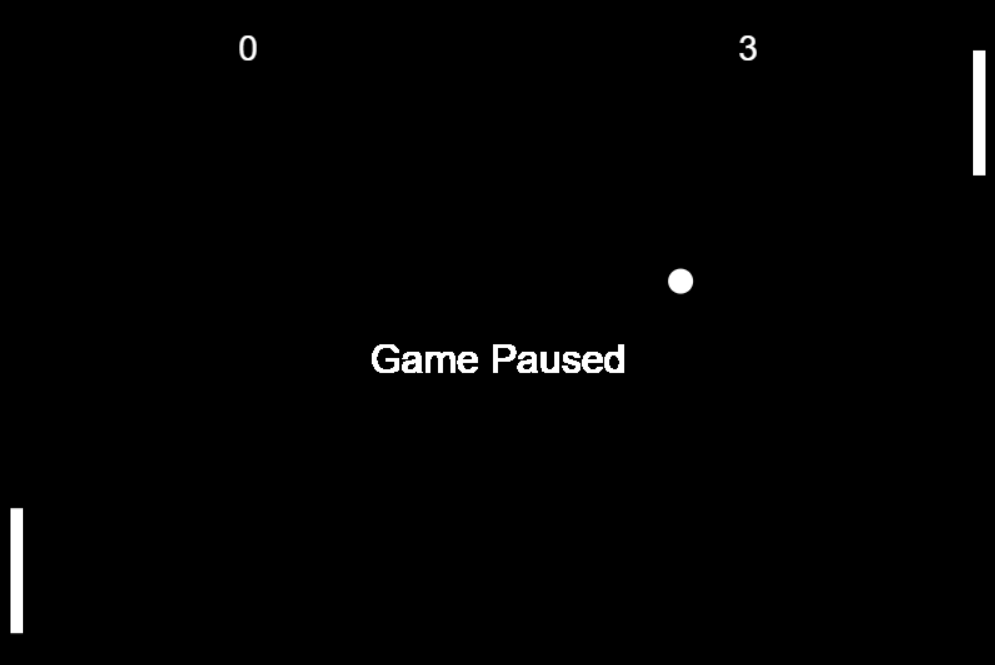
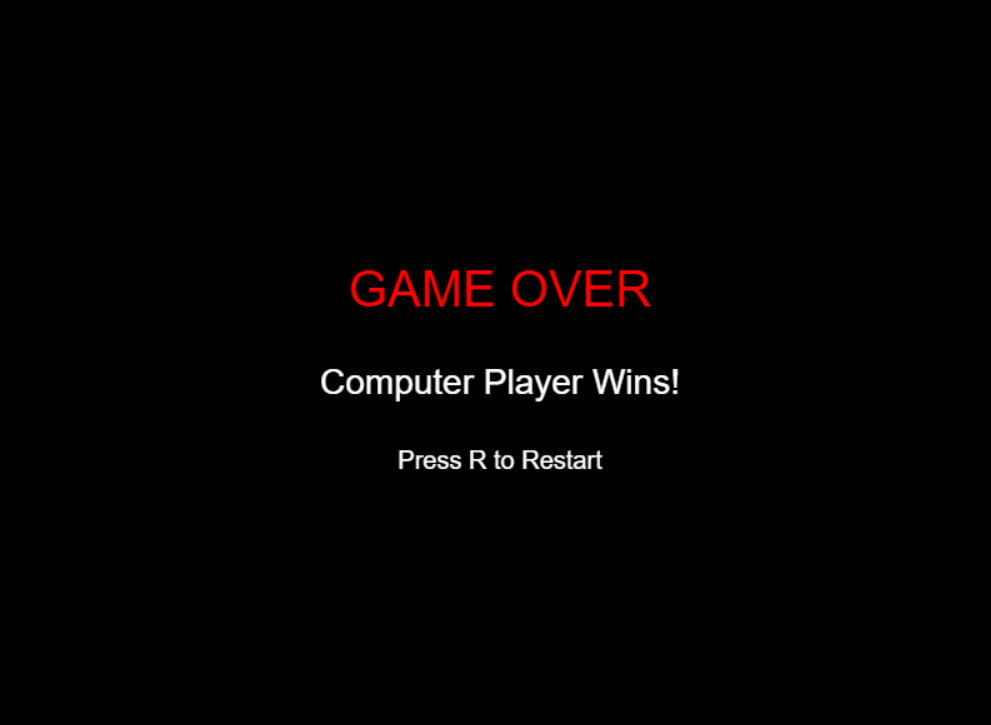
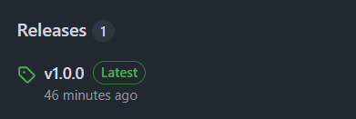

# Pong Game

A simple and engaging cross-platform Pong game developed with Vibe Coding, featuring intuitive controls and a classic arcade experience.

---
### Fast-Paced, Dynamic Matches

---
### Challenge Friends or AI—Victory Awaits the Best!

### Ready to Play ? Go to the releases section now

> To download and play the game, visit the "Releases" section of this GitHub repository.  
> Choose the release version you want, then download the zip file corresponding to your operating system (e.g., Windows, macOS, or Linux).  
> Extract the contents of the zip file and follow any included instructions to start playing.

NOTE: Releases section looks like this and is usually towards the right side of the page.

